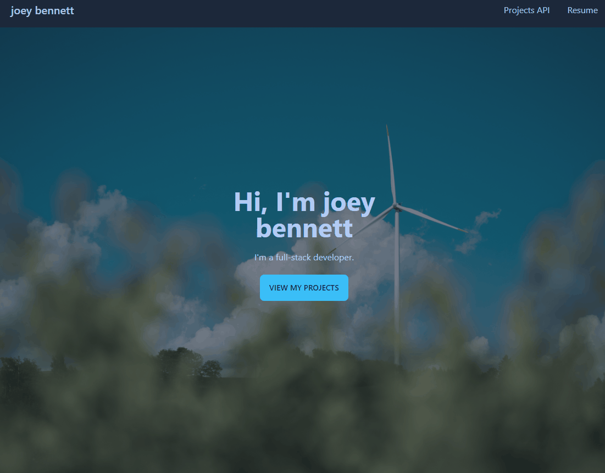

# Full Stack Portfolio
Welcome to my <a href="https://joeys-full-stack-portfolio.herokuapp.com/">full stack portfolio</a>!

## Description
My portfolio was made to present the projects I have been working on recently, who I am and what I do as a full stack web developer. This portfolio also contains my projects on a live heroku server!

## Table of Contents
1. [Usage](#usage)
2. [Technologies Used](#technologies)
3. [Author](#author)
4. [License](#license)

## Usage
To use my full stack portfolio, you can visit the <a href="https://joeys-full-stack-portfolio.herokuapp.com/">site</a>!

When you visit the site you will see the navbar at the top of the page, where you can select to view my resume or the API with my projects listed in it!

My portfolio site also includes some information about me. If you scroll down a little you will see that section. If you click on the button to view my projects or scroll further you will see all the projects I have listed in my API.

You can also always click on my name on the navbar to go back to the top of the page!

## Technologies
Here is a list of the technologies used in this application:
* [Handlebars](https://handlebarsjs.com/)
    - Handlebars is a very useful templating tool which helped me quickly generate the projects from my projects API
* [Sequelize](https://sequelize.org/)
    - Sequelize is a great ORM to configure the models for my projects
* [Node.js](https://nodejs.org/en/)
* [MySQL](https://www.mysql.com/)
* [Express.js](https://expressjs.com/)
* [bcrypt](https://www.npmjs.com/package/bcrypt)
* [dotenv](https://www.npmjs.com/package/dotenv)
* [heroku](https://www.heroku.com/)
* [tailwind.css](https://tailwindcss.com/)
* [daisyui](https://daisyui.com/)

## Author
My name is Joey Bennett and I created this portfolio to present my projects and what I have been working on. If you are interested in collaborating on a project send me a message at [coderbennett1@gmail.com](mailto:coderbennett1@gmail.com), or feel free to reach out to me on any of my social media pages:

* [GitHub](https://github.com/coderbennett)
* [LinkedIn](https://www.linkedin.com/in/joey-bennett-jkb/)
* [Twitter](https://twitter.com/joeykalanchoe)
* [Portfolio](https://coderbennett.github.io/web-portfolio/)

## License
My portfolio is licensed under the MIT license. For licensing details visit the [LICENSE](LICENSE) document.
